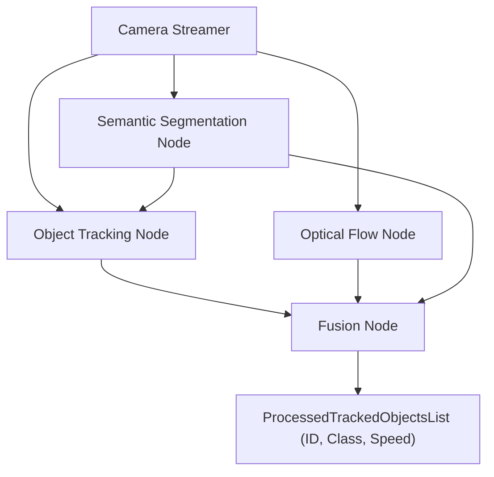

# Perception Stack for Object Segmentation, Tracking & Motion Estimation

This project implements an **integrated ROS-based perception pipeline** designed to detect, track, and estimate the speed of moving objects in real time.  
It simulates the core components of a robotic perception system, suitable for applications such as **autonomous driving**, **robot navigation**, and **intelligent surveillance**.

---

## Project Overview

The perception stack is built with multiple **ROS nodes** that communicate asynchronously to process a live video stream:

1. **Camera Streamer** – Streams raw video frames.  
2. **Semantic Segmentation Node** – Classifies pixels and detects objects.  
3. **Object Tracking Node** – Assigns unique IDs and tracks objects across frames.  
4. **Optical Flow Motion Estimation Node** – Estimates per-object speeds.  
5. **Fusion Node** – Aggregates and publishes final object data (ID, class, speed).

---

## System Architecture



---

## Core Components

### 1. Camera Streamer
- Publishes frames to `/cam_stream`.
- Acts as the primary source of image data.

### 2. Semantic Segmentation
- Subscribes to `/cam_stream`.  
- Performs pixel-wise classification and object detection.  
- Publishes detection results to `/semantic_segmentation`.

### 3. Object Tracking
- Model: **DeepSORT** with **MobileNet embeddings**.  
- Tracks objects with unique IDs.  
- Publishes to `/object_tracking`.  
- **Key Parameters:**
  - `max_age = 30`  
  - `nms_max_overlap = 1.0`  
  - `max_cosine_distance = 0.4`

### 4. Optical Flow Motion Estimation
- Algorithm: **Farneback Dense Optical Flow**.  
- Subscribes to `/cam_stream`.  
- Estimates velocity vectors and publishes flow data.  
- Calculates speed for each tracked object.

### 5. Fusion Node
- Subscribes to `/object_tracking`, `/semantic_segmentation`, and `/optical_flow_field`.  
- Combines flow and tracking info to compute **speed (m/s)**.  
- Publishes `ProcessedTrackedObjectsList`.

---

## ROS Communication

| Node                    | Publisher Topic               | Subscriber Topics                              | Purpose                                     |
|--------------------------|-------------------------------|-----------------------------------------------|--------------------------------------------|
| Camera Streamer          | `/cam_stream`                 | -                                             | Stream video frames                        |
| Semantic Segmentation    | `/semantic_segmentation`      | `/cam_stream`                                 | Perform object detection and segmentation  |
| Object Tracker           | `/object_tracking`            | `/cam_stream`, `/semantic_segmentation`       | Track objects with IDs                     |
| Optical Flow Estimator   | `/optical_flow_speeds`        | `/cam_stream`                                 | Estimate object speeds                     |
| Fusion Node              | `/object_list`                | `/object_tracking`, `/optical_flow_speeds`, `/semantic_segmentation` | Aggregate and publish object info |

---

## Message Types

- `BoundingBox` – Object bounding box coordinates  
- `DetectionList` – List of detected objects  
- `TrackedObject`, `TrackedObjectsList` – Object tracking data with IDs  
- `FlowFrame` – Optical flow vectors and timing  
- `ProcessedTrackedObjectsList` – Final output with object ID, class, and speed

---

## Tech Stack

- **ROS** (Robot Operating System)  
- **OpenCV** (Farneback Optical Flow)  
- **YOLOv8** (Real-time object detection — bounding boxes & class IDs)
- **DeepSORT + MobileNet** (Tracking)  
- **Python / C++** (Implementation)  
- **Custom ROS Messages** for communication

---

## Installation & Usage

```bash
# Clone the repository
git clone https://github.com/Ayaabdelmoneam/Perception-Stack-for-Object-Segmentation-Tracking-and-Motion-Estimation-.git
cd catkin_ws

# Build the ROS workspace
catkin_make

# Source the setup
source devel/setup.bash

# Run the camera streamer
rosrun perception camera_streamer.py

# Run the segmentation node
rosrun perception semantic_segmentation.py

# Run the tracker
rosrun perception object_tracking_2d.py

# Run the Speed Estimation Node
rosrun perception speed_estimation.py

# Run the Processor (Fusion) Node
rosrun perception proccessor.py
```

---
[](https://drive.google.com/file/d/1NALr-fr_morRhIwFzsfsNjB_tWdriFp_/view?usp=sharing)
